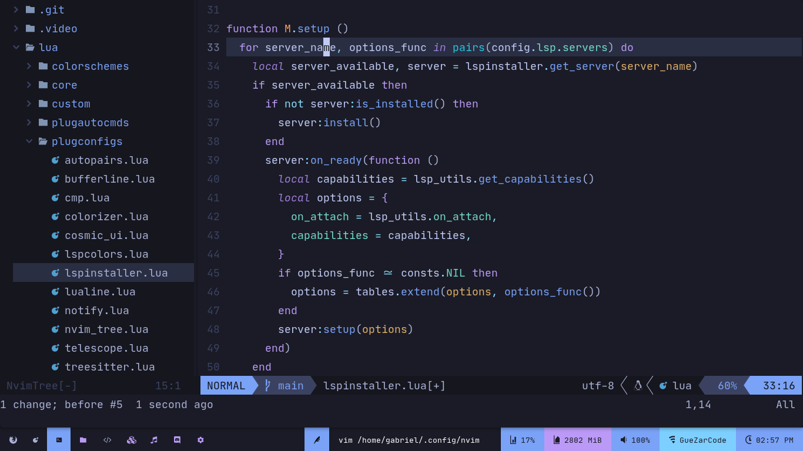
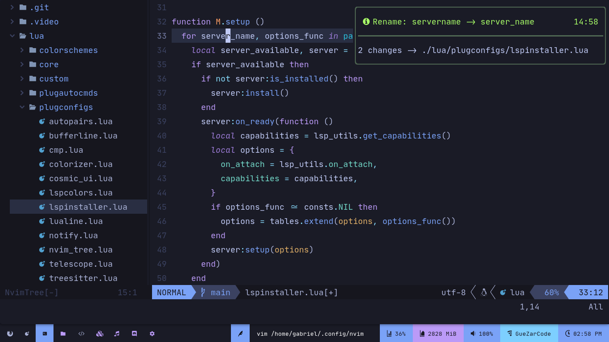
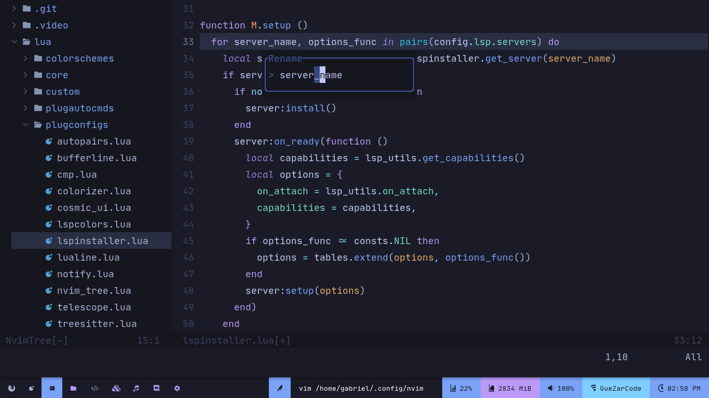

# Dark Nvim

Another attempt to make of neovim a complete IDE.



## Inspiration

- [CosmicNvim](https://github.com/CosmicNvim/CosmicNvim)
- [NvChad](https://github.com/NvChad/NvChad)

## Installation

DarkNvim uses as a **important** depedency
[packer](https://github.com/wbthomason/packer.nvim), you will install
darknvim and packer with these commands

> In the future I will install packer automatically where packer are not installed

```sh
test -d ~/.config/nvim && mv ~/.config/nvim ~/.config/nvim.old # Backup your old configs
test -d ~/.local/share/nvim && mv ~/.local/share/nvim ~/.local/share/nvim.old # Backup your neovim plugins and another stuff
test -d ~/.cache/nvim && mv ~/.cache/nvim ~/.cache/nvim.old # Backup neovim cache, like lsps logs
cd ~/.config
git clone https://github.com/AlphaTechnolog/darknvim nvim # Clone darknvim
git clone --depth 1 https://github.com/wbthomason/packer.nvim\
 ~/.local/share/nvim/site/pack/packer/start/packer.nvim # Install packer
nvim +PackerInstall # Install the plugins
```

## Uninstallation

You can uninstall darknvim removing these directories:

- ~/.local/share/nvim # Lsps binaries and some other stuff
- ~/.config/nvim # Darknvim config
- ~/.cache/nvim # Cache of nvim like lsps logs

## Galery





> Using [cosmic-ui](https://github.com/CosmicNvim/cosmic-ui) for renaming and code actions
