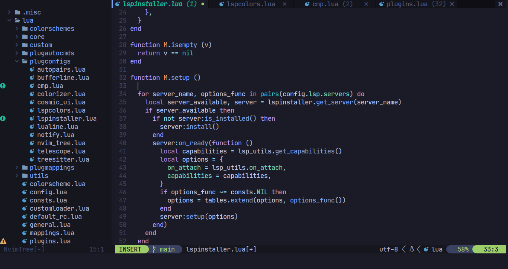
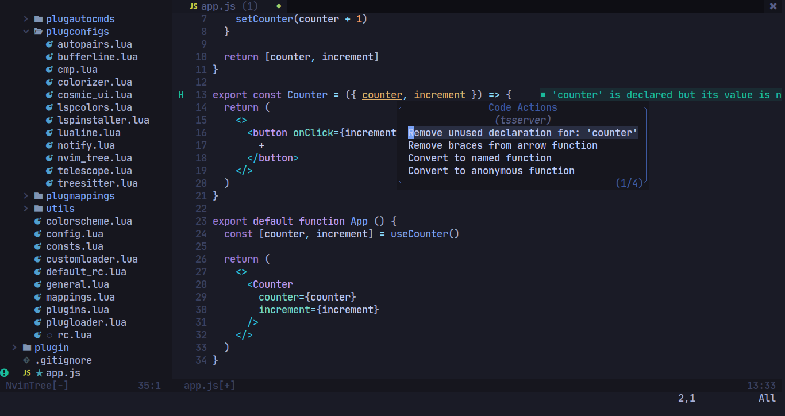
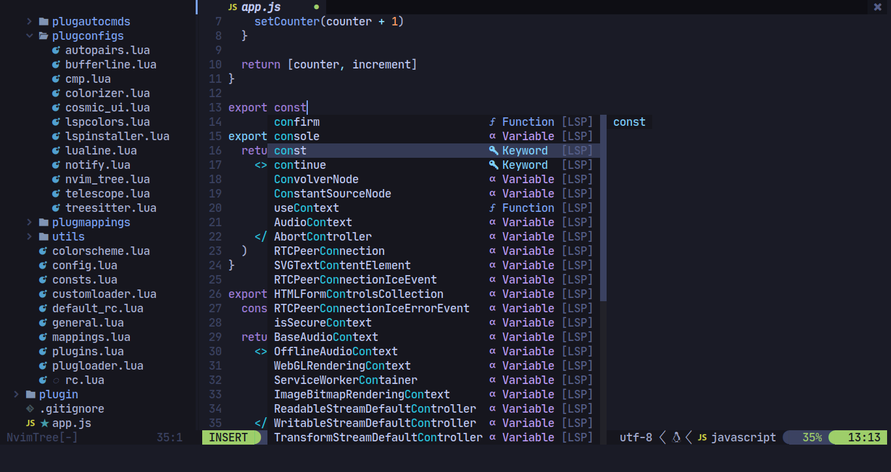

# NvCoDark

Another attempt to make of neovim a complete IDE.



## Thanks to

- [K0K41](https://github.com/K0K41) (for the name of nvcodark)

## Inspiration

- [CosmicNvim](https://github.com/CosmicNvim/CosmicNvim)
- [NvChad](https://github.com/NvChad/NvChad)

## Installation

NvCoDark uses as a **important** depedency
[packer](https://github.com/wbthomason/packer.nvim), you will install
nvcodark and packer with these commands

> In the future I will install packer automatically where packer are not installed

```sh
test -d ~/.config/nvim && mv ~/.config/nvim ~/.config/nvim.old # Backup your old configs
test -d ~/.local/share/nvim && mv ~/.local/share/nvim ~/.local/share/nvim.old # Backup your neovim plugins and another stuff
test -d ~/.cache/nvim && mv ~/.cache/nvim ~/.cache/nvim.old # Backup neovim cache, like lsps logs
cd ~/.config
git clone https://github.com/AlphaTechnolog/nvcodark nvim # Clone nvcodark
git clone --depth 1 https://github.com/wbthomason/packer.nvim\
 ~/.local/share/nvim/site/pack/packer/start/packer.nvim # Install packer
nvim +PackerInstall # Install the plugins
```

## Uninstallation

You can uninstall nvcodark removing these directories:

- `~/.local/share/nvim`: Lsps binaries and some other stuff
- `~/.config/nvim`: NvCoDark config
- `~/.cache/nvim`: Cache of nvim like lsps logs

## Creating your config

By default nvcodark reads a file named `lua/default_rc.lua`, it file is tracked
by git, is recommended you create your custom config, to it copy it file content
and create a new file named `lua/rc.lua` that contains the `lua/default_rc.lua`
content, you can do it with a simple sh command:

```sh
cp -r ./lua/default_rc.lua ./lua/rc.lua
```

And then edit it as you want. It file isn't tracked by git, it's in the gitignore
your configuration may not be shared with others people.

> Read the next section that creates more content in the config file

## Themes

I will add more but in this moments it only support these themes:

- tokyonight (default)
- ayu dark
- calvera
- catppuccin
- gruvbox
- material
- onedark
- onedarker (by me :D)
- pywal (by me :D)

### Enabling a theme

Check if the theme name exists in the colorschemes folder (`lua/colorschemes`)

Example: If your colorscheme name is catppuccin, you may check if the file
`lua/colorscheme/catppuccin.lua` exists if yes put this in your config:

```lua
config.colorscheme = 'catppuccin'
```

If you want to change the lualine theme you can modify this:

```lua
config.lualine = {
  theme = 'catppuccin',
}
```

### Creating your custom colorscheme

Colorschemes in nvcodark works as a function that is executed at colorschemes
loading lifecycle. In this example we create the support for the
[navarasu/onedark.nvim](https://github.com/navarasu/onedark.nvim).

To it first install the plugin adding to the `additional_plugins` section in
your private config, modify `lua/rc.lua`

```lua
config.plugins = {
  additional_plugins = {
    {'navarasu/onedark.nvim', as = 'onedark'},
  },
  -- your other config
}
```

Then reload nvim, and install it with: `:PackerInstall` or `:PackerSync`.

Create a file named `lua/colorschemes/onedark.lua`, basically it may return a table with
the property enable that may be a function which is supposed to activate the theme.

Put this:

```lua
local M = {}
local present, onedark = pcall(require, 'onedark')

if not present then
  return {
    enable = function ()
      error('[WARN/plugins/onedark]: Cannot import onedark')
    end
  }
end

M.enable = function ()
  onedark.load()
end

return M
```

Basically it handles possibly errors at try to import a not installed plugin.

Then activate it in your config, put this in `lua/rc.lua`:

```lua
config.colorscheme = 'onedark' -- it would load /lua/colorschemes/onedark.lua and call enable

config.lualine = {
  theme = 'onedark', -- change thet lualine theme to onedark (it's provided by the theme)
}
```

And that's all.

## Custom hooks

The custom hooks are functions that are executed to allow you custom the
work of neovim in your custom and private config.

Exists a folder with some examples, let's create a custom hook that defines
some autocmds (set `tabstop=4 shiftwidth=4 expandtab` for php files and python files).

To it, copy the file `lua/custom/examples/autocmds.lua` to `lua/custom/autocmds.lua`,
and edit it, you will get a file content like this:

```lua
local M = {}

M.init = function ()
  -- write your autocmds here
  vim.cmd [[ autocmd FileType php setlocal tabstop=4 shiftwidth=4 ]]
  vim.cmd [[ autocmd FileType python setlocal tabstop=4 shiftwidth=4 ]]
end

return M
```

It's exactly where we need, the module exports a table that contains the function
`init`, and it's executed as main function by `lua/customloader.lua`.

### Activating the autocmds custom hook

Put this in your rc.lua:

```lua
config.custom = {
  load = {
    autocmds = true,
  },
}
```

The load key contains a table where the key of an item is the name of the file that will be
loader in `lua/custom/x.lua` where `x` is the name of the key. e.g:

```lua
config.custom = {
  load = {
    requests = true,
  },
}
```

It will load a file in `lua/custom/requests.lua`

The value is if you want to enable it or not (boolean val)

## Galery





> Using [cosmic-ui](https://github.com/CosmicNvim/cosmic-ui) for renaming and code actions
